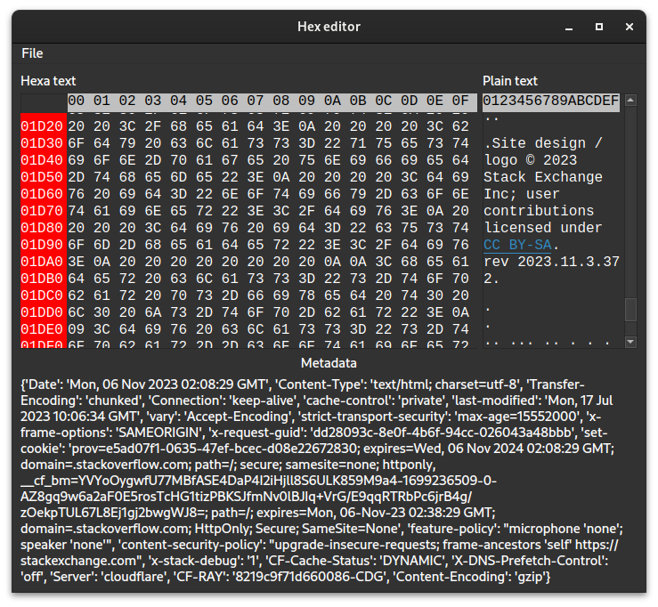

# HexEditor

## Running:

create an environment and install requirements: `pip install -r requirements.txt`

Run editor: `python editor.py`

## Controls

To open file:

- File -> Open (select in the prompt your file)
- File -> Open from URL (type a valid url)

To edit hexadecimal:

- `<Insert>` will add a new byte in the file set to 0x00
- `<Delete>` will delete the current selected byte
- `<Backspace>` will reset the current character to 0
- Keys corresponding to hexadecimal value will replace current character

To edit plain text:

- `<Backspace>` will delete the last character
- All others keys will insert text
